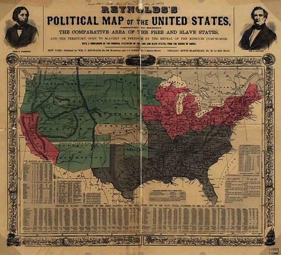
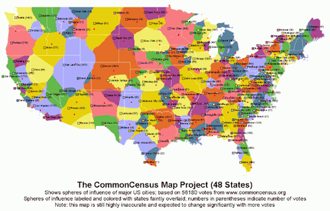
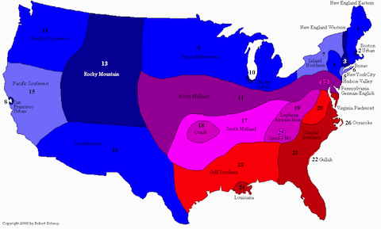
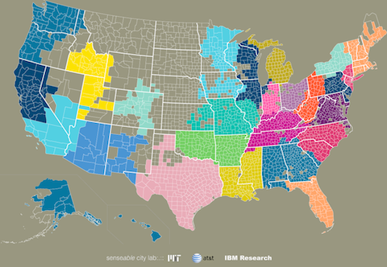
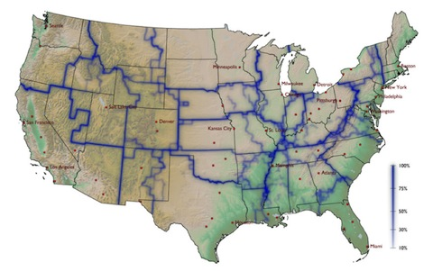
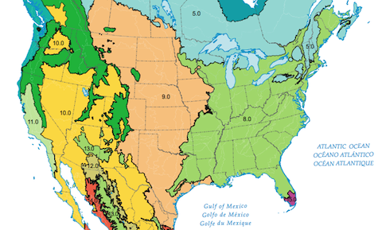

It's inevitable that we carve up geography to group people. Political borders are usually the result of negotiations between land-hungry powers, or politicians seeking to tweak group distribution.

Julian Oliver's [Border Bumping](http://borderbumping.net/) project has me thinking again about alternate motivations, so I've assembled some of my favorite alternative approaches to US cultural cartography:

William C. Reynold's [slavery map](http://myloc.gov/Exhibitions/lincoln/rise/TheNewLincoln/KansasNebraskaAct/ExhibitObjects/ReynoldsUSPoliticalMap.aspx) was one of the first artifacts that piqued my schoolboy interest in cartography. It may be quite simplistic, but was (and remains) very effective in communicating the state of the nation in 1856.

Michael Baldwin's [Common Census](http://commoncensus.org/maps.php) is my modern favorite, built by voluntary association with named places. It should be no surprise that cities are highly influential.[^city] 

[^city]: or that [I consider this a more valid method of grouping than states](/2011/10/20/city-rights.html).

Another favorite view is [Robert Delaney's dialect regions](hhttp://www.uta.fi/FAST/US1/REF/dial-map.html), or [Rick Aschmann's similar work](http://aschmann.net/AmEng/).

Also using communication, MIT, AT&T, IBM, and probably some other [TLAs](http://www.catb.org/jargon/html/T/TLA.html) have mapped [socially connected regions based on mobile phone calls](http://senseable.mit.edu/csa/visuals2.html). Then with Vincent Blondel (of [phone identification](http://mit.edu/newsoffice/2013/de-anonymize-cellphone-data-0327.html) fame) they [went meta](http://www.theatlanticcities.com/arts-and-lifestyle/2012/04/invisible-borders-define-american-culture/1839/).

Alan McConchie has an ongoing project to track what Americans [call soft drinks](http://www.popvssoda.com/) that shows some pretty clear boundaries.[^soda][^tea]

[^soda]: [Edwin Chen](http://blog.echen.me/2012/07/06/soda-vs-pop-with-twitter/) has mined Twitter for similar data.

[^tea]: See also the [sweet tea divide](http://bigthink.com/strange-maps/317-tea-as-a-northsouth-litmus-test).

Dirk Brockmann got a lot of attention mapping [areas of mobility](http://rocs.northwestern.edu/projects/community_structure.html) using paper currency tracking as a proxy[^mobility] and points out it corresponds well to [BEA Economic Areas](http://www.bea.gov/regional/bearfacts/countybf.cfm?sublist=next&areatype=econ).

[^mobility]: [Livehoods](http://livehoods.org/research) has similar goals using checkin data from Foursquare and operating at the city level.

Neil Freeman has drawn [fifty states of equal population](http://fakeisthenewreal.org/reform/).

Finally, I wouldn't be a proper citizen of [Cascadia](http://www.cascadianow.org/about-cascadia/) if I didn't include [ecoregions](http://www.epa.gov/wed/pages/ecoregions/na_eco.htm#Level%20I).
