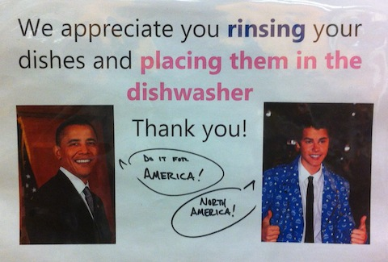
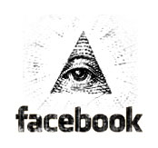

Recently at frog's Seattle studio we put to test the well-studied phenomenon of [images with eyes encouraging prosocial behavior][eyes]. Our office admins report a 90% reduction in dirty dishes left carelessly in or around the sink after placing a sign with faces exhorting us to behave like responsible adults. Previous text-only signs had led to no detectable improvement.

[eyes]: http://blogs.discovermagazine.com/notrocketscience/2008/05/10/how-big-brother-keeps-us-honest/

It was long ago showed that even [subtle exposure][subtle] to very stylized images of eyes strongly increases prosocial behavior. Melissa Bateson, a zoologist interested in how starlings react to images eyes, recently established the effect works with humans [even without an accompanying message][textless]. Adding credence to the conclusion that a sense of being "watched" is behind all this, it's been discovered that even atheists can be similarly [primed by invoking god][god].

[textless]: http://behaviourlibrary.com/Ernest-Jones%20et%20al%202011.pdf
[subtle]: http://www.unil.ch/webdav/site/dee/shared/textes/Haley_Fessler_EvolHumBehav_2005.pdf
[god]: http://www2.psych.ubc.ca/~azim/shariffnorenzayan2007.pdf

But who needs god, the POTUS, or even Bieber? Certainly our buying behavior is also an indicator for feeling "watched" when we avoid making certain purchases in public. [University of Miami research][miami] has recently shown that our in-public behavior mode can be triggered not by anything as direct as pictures of our Facebook friends, but simply by the **logos** of social sites.

[miami]: http://bus.miami.edu/news-and-media/recent-news/townsend-social-media-12.html

I'd love to know if the incidence rate of trolling is reduced in commenting systems that display a Facebook login, even if they don't require its use.
