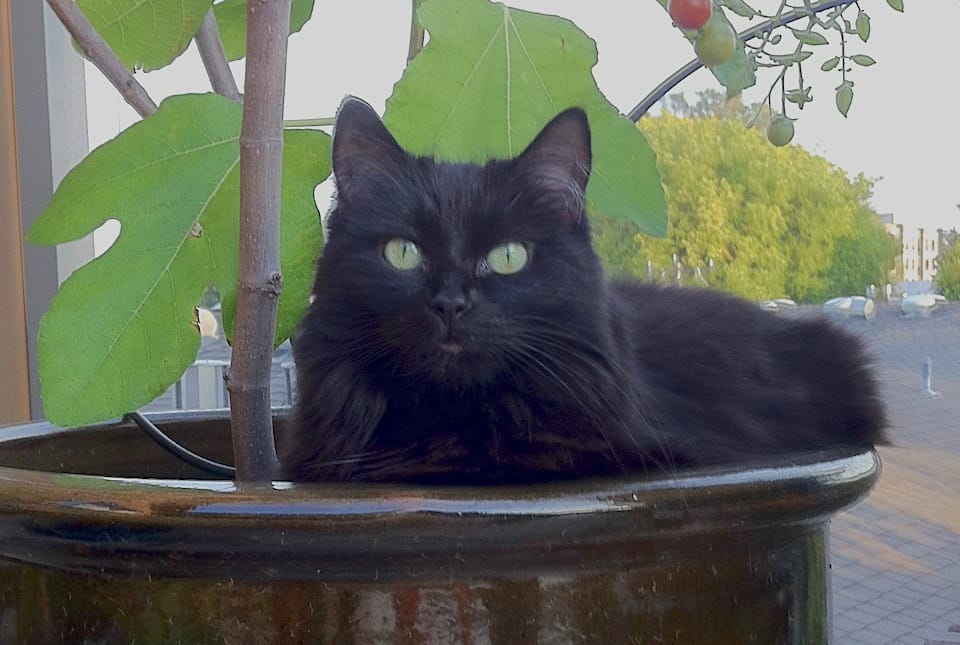

On Tuesday, we lost our cat, Shea.

{:width="480px"}

As these things do, it happened slowly and then suddenly. Her health had been noticeably declining for a year, but still it was a complete surprise when the last day came.

I’ve lived with seven cats, but Shea and I were closest.[^kitty]

[^kitty]: Only the second, Kitty, spent as much time with me and under very different conditions. He was an outdoor cat during childhood and we lived apart for the second half of his long life.

It hurts more than I imagined. I see, now, that Shea was a very important “loop” for both Shannon and me.

Modern cognitive science has come to appreciate that while some of the feedback loops that comprise our selves may be wholly internal to the brain, many include the rest of the body and still others include the outside world.[^loop] As David Chalmers says, the mind bleeds into the world. In _[I Am a Strange Loop](https://www.goodreads.com/book/show/2666176.I_Am_a_Strange_Loop)_, Douglas Hofstadter beautifully describes his relationship with his wife in these terms.[^strange] Countless others have also described these loops in terms that include culture, which is easy to think about because the inputs and outputs are so tangible. Human relationships are easy to see as loops of explicit communication.

[^loop]: I appreciate that this is a dramatic simplification.
[^strange]: A passage that describes learning to experience fluently with another’s perspective was read at our wedding.

There are many channels, though, to our relationships. Besides the technical and rational, we engage in emotional and aesthetic communication. A cathedral is more sublime than ordinary shelter; a beloved family member is meaningful to us in ways quite different than a close coworker. The emotional and aesthetic channels form very powerful loops, even if they are less available for conscious perception and understanding.

I only appreciate in the loss how strong my emotional loops with Shea were. She was an important part of how I understood Shannon, as they lived together when I met them; their mutual affection was meaningful to me. Shea and I formed bonds of reliance on each other, and her desire for routine helped me establish rhythms as the contexts of our lives changed. Her perception of me as a large cat has irreversibly influenced my own self-image.

{:width="480px"}

Her presence defined home. Now I feel homeless.

This is hard to describe and I am certainly failing now, but I hope it serves as a mnemonic in the future. Along those lines, let me list some memories I hope to never lose:

- sitting on the dining table with no interest in disturbing our food, but regular moved on water glasses
- waiting until I have committed to walking up or down stairs to bother following me, especially if Shannon hasn't yet
- walking me to her food bowl and not eating until I touched it, even if I didn’t refill it
- post-poop celebration runs, often pre-announced with a loud meow
- the loud period (at Prinseneiland), when she went from being mostly quiet to regularly talking
- sitting with me in Shannon’s studio in St. Louis
- lying in front of the fireplace or on the orange ottoman in Seattle
- threatening outdoor cats thrice her size in Amsterdam
- sneaking into any open cabinet and closet
- attacking ribbon viciously with claws and teeth bared, but with care not to scratch me
- allowing me to hold her, even cradled upside down (until I descend stairs)
- sharpening her claws on anything made of wood or carpet, unless it was intended for such
- rubbing her cheek on MacBooks
- finding a place to rest with a Shea-scale ceiling
- daredevil countertop leaps in pursuit of sinks
- performance of the Crazy Kitty Hour
- earning the title Chief Underfoot
- the headbutts
